# Oliver's Computer Science Portfolio 
(Updated 24th July 2022)  

<!-- ## Introduction  
I'm Oliver, a recent graduate of Information Technology majoring in Computer Science and Simulation Science. I have a strong passion for high performance and mathematically based systems. My Inspirations are Jonathan Blow, Andrei Alexandrescu and Mike Acton (aswell as many of the great speakers at CPP Con). These people consistently challenge the fundamental ideas of what it means to focus on performance improving the software industry to atleast try and utilize some of the sheer computation that modern hardware provides (and isn't always used well). I am always working on something, whether it be a small, medium, or large sized project. I focus on learning new technologies to increase my expertise, improving my work ethic and flexing my brain with problem solving whenever I can.  -->

### "Want fast C++? Know your hardware!" - Timur Doumler cppcon 2016  

## Skills/Certifications
### Backelors of Information Technology from Queensland University of Technology GPA 5.8
***Languages 👨‍💻***  
C, C++, Golang, Rust, C#, Java, SQL, Python, Javascript, Typescript, HTML, CSS, Groovy, Lua, MATLAB, F#, R, Bash, XSLT  
***Technologies/Libraries 🦾***  
Linux, Git, Git Pipeline, Docker, Kubernetes, Terraform, Selenium, Cucumber, Jenkins, P5.js, SFML, Wordpress, SDL2, ImGui, SIMD, Node, GCP, AWS, Angular, ActiveMQ, Restful API, Docmosis, LibreOffice, JMS, Google Web Toolkit  
**Soft Skills ✍**  
Word, Excel, PowerPoint, Git, Agile, 
Jira, Confluence, Bitbucket
<!-- 
## Interested Technologies
These are just some technologies I know a bit about and want to learn more  
Compiler Design, OpenGL, Vulkan, Fluid Dynamics, Voxel Rendering, Cryptography, JAI

## Contacts
Email: Ober3550@gmail.com

## C++ Project Template
When I first started learning C++ it was just so difficult. Too many things to know, too many conflicting sources and lastly too many documents without a working demo. So that's why I've made my own template that people are free to use. It's lightweight, has great libraries installed and a small amount of code for the stuff that I know I struggled with so you don't have to.  
https://github.com/ober3550/My-Template

## Factorio Mods (Lua)
Creating many multi-faceted modules that interact with a potentially infinite number of other modules is a challenge in dependency and future planning.  
https://mods.factorio.com/user/ober3550  

## Leetcode Algorithm Practice
https://leetcode.com/ober3550   -->

## [Gravity (C++, SFML, ImGui, SIMD)](https://github.com/ober3550/SolarSim)   
Gravitational simulation focused on both speed and visualization.  
  
  

## [Rust Demo Project](https://github.com/Ober3550/RustyRoboFactory)  
Dipping a toe into the ecosystem of rust  
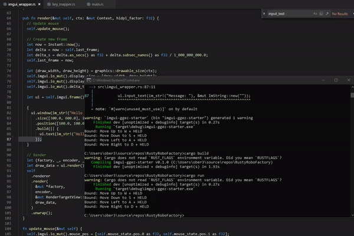  

<!-- 
## Auto Budgeter (Excel)
Automatically categorise transactions based on keywords.  
[Check it out here](https://github.com/ober3550/AutoBudget)  
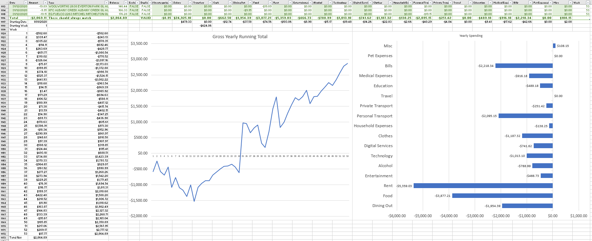 -->

## Wave Equation (Matlab)  
  
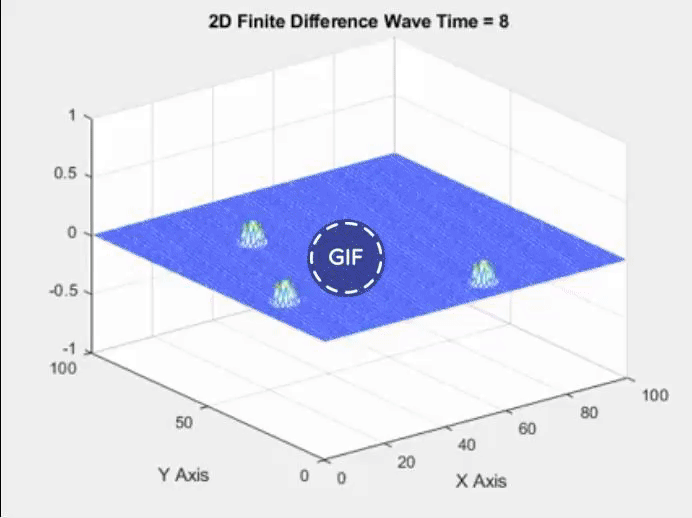  

## [Icosphere/Opengl Testing (C++, OpenGL)](https://github.com/Ober3550/My-Template)    
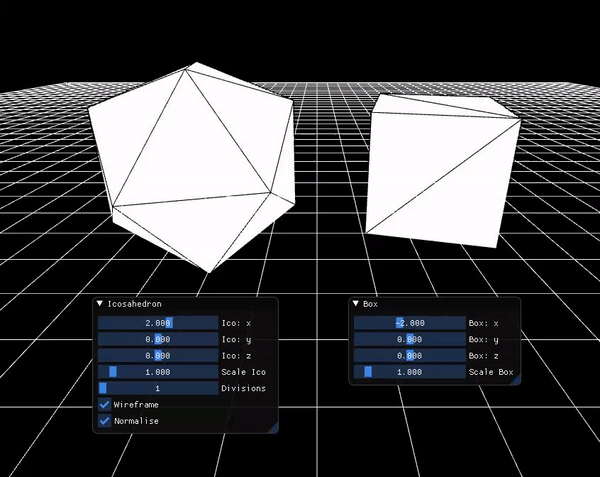   
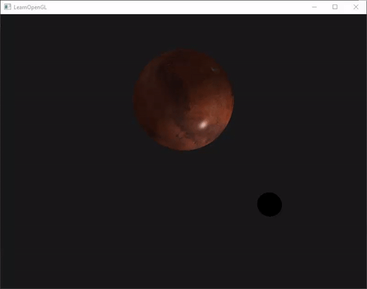   

## [Fluid Sim Project (C++, SFML, ImGui)](https://github.com/ober3550/FluidSim)   
Fluid sim project inspired by Fluid Simulation for Dummies by Mike Ash  
  

## [Ninja Platformer (P5.js)](https://ober3550.github.io/ninja.html)
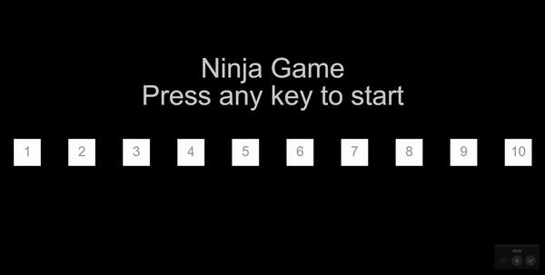  

## [Wave Function Collapse](https://ober3550.github.io/wavefunctioncollapse.html)
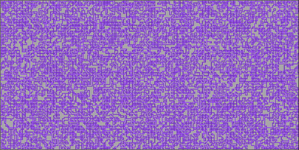  

## [Traveling Salesman](https://ober3550.github.io/TravelingSalesman.html)
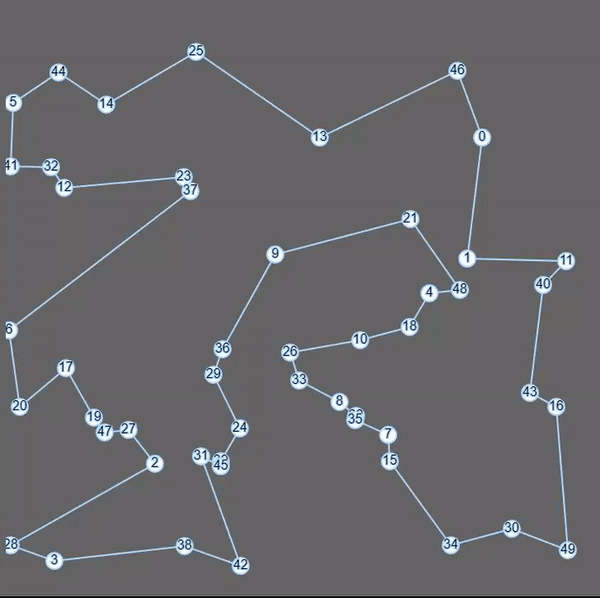  

## [Pathfinder (P5.js)](https://github.com/Ober3550/Pathfinder)
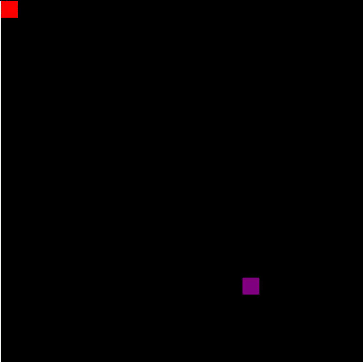  

## Off axis bouncing (P5.js)
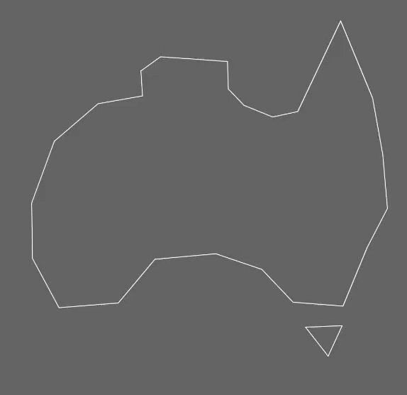  

## [Tetris (P5.js)](https://github.com/Ober3550/BlockGame)
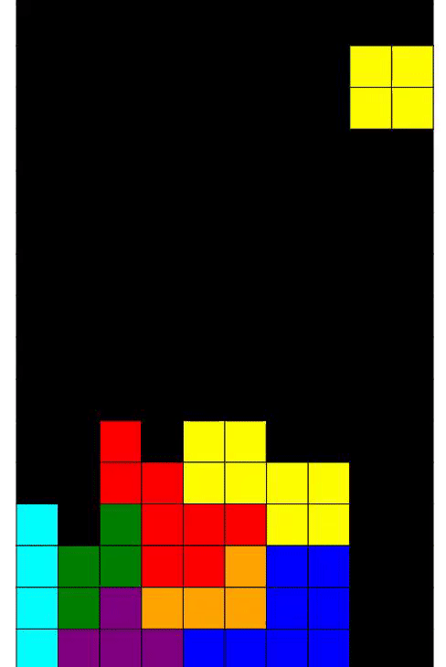    

## 2048 Game (P5.js)
  

## Beetle Render (Matlab)
  

## Pentagon Invader (C++)
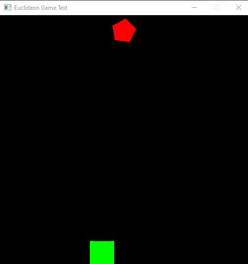  

## Brain Scan (Matlab)
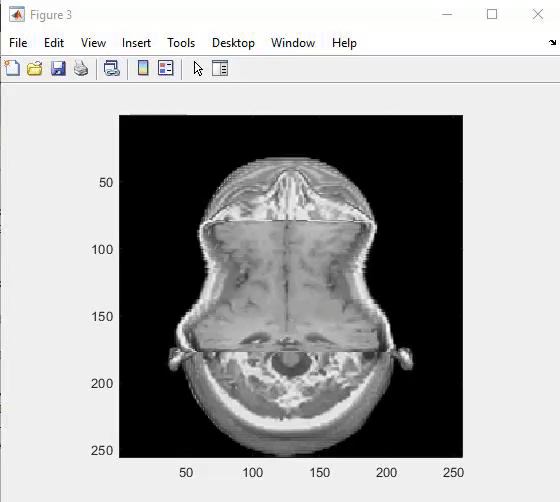  

## RoboFactory Game (C++, SFML, ImGui)  
Learning the importance of planning, long term project management and motivation toward a goal.  
[Check Out The Project for More!](https://github.com/ober3550/RobotComplex)  
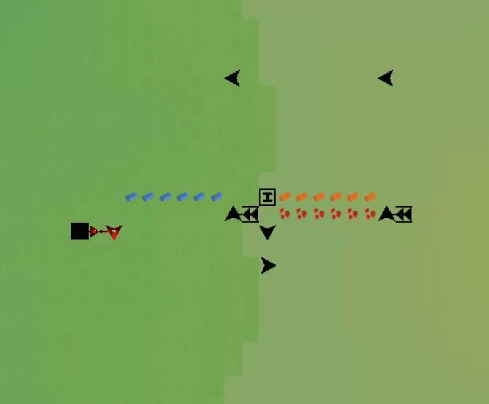

