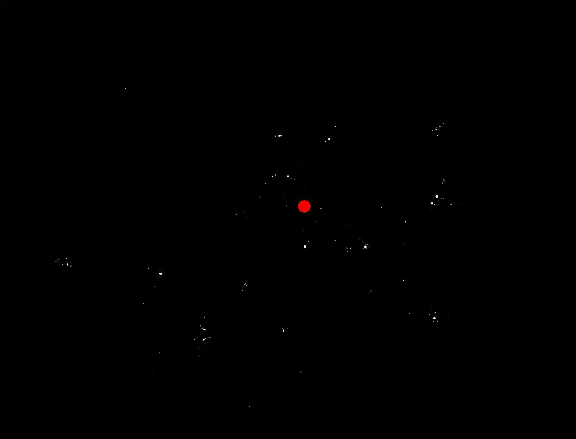

# Oliver's Computer Science Portfolio 
(Updated 26th August 2023)  

<!-- ## Introduction  
I'm Oliver, a recent graduate of Information Technology majoring in Computer Science and Simulation Science. I have a strong passion for high performance and mathematically based systems. My Inspirations are Jonathan Blow, Andrei Alexandrescu and Mike Acton (aswell as many of the great speakers at CPP Con). These people consistently challenge the fundamental ideas of what it means to focus on performance improving the software industry to atleast try and utilize some of the sheer computation that modern hardware provides (and isn't always used well). I am always working on something, whether it be a small, medium, or large sized project. I focus on learning new technologies to increase my expertise, improving my work ethic and flexing my brain with problem solving whenever I can.  -->

### "Want fast C++? Know your hardware!" - Timur Doumler cppcon 2016  

    
<h2>Amazing Lectures about Technology</h2>

  
<h3>High Performance Computing</h3>

  

  <a href="https://youtu.be/0_Byw9UMn9g" text-decoration="none">
    <h4 color="black">Unity - Data Oriented Design for Maximum Performance</h4>
    
  </a>

  

  <a href="https://youtu.be/t1R7ElXEyag" text-decoration="none">
    <h4 color="black">Lightmatter - Photonic Computing</h4>
    
  </a>

  

  <a href="https://youtu.be/AQERQd4RreA" text-decoration="none">
    <h4 color="black">Lingon Studios - Assembly vs C++ vs C# Unity Particle Sim</h4>
    
  </a>

  

  <a href="https://youtu.be/4KtotxNAwME" text-decoration="none">
    <h4 color="black">Greg Johnston - Performance differences between web frameworks</h4>
    
  </a>

  

  <a href="https://youtu.be/gzgyksS5pX8" text-decoration="none">
    <h4 color="black">Jim Keller - Making computers faster by 1,000-10,000x</h4>
    
  </a>

  

  <a href="https://youtu.be/7VHG6Y2QmtM?t=770" text-decoration="none">
    <h4 color="black">Strager - Big O lies about performance for small n</h4>
    
  </a>

  

  <a href="https://youtu.be/DMQ_HcNSOAI" text-decoration="none">
    <h4 color="black">Strager - All possible optimization options</h4>
    
  </a>

  

  <a href="https://youtu.be/tD5NrevFtbU" text-decoration="none">
    <h4 color="black">Mollyrocket - Clean code horrible performance</h4>
    
  </a>

  

  <a href="https://youtu.be/8uAW5FQtcvE" text-decoration="none">
    <h4 color="black">David Gross - Trading at light speed</h4>
    
  </a>

  

  <a href="https://youtu.be/sZxjuT1kUd0" text-decoration="none">
    <h4 color="black">Dr Trefor Bazett - Fastest matrix multiply</h4>
    
  </a>

  

  <a href="https://youtu.be/ssDBqQ5f5_0" text-decoration="none">
    <h4 color="black">Low Level Learning - The performance of division</h4>
    
  </a>

  

  <a href="https://youtu.be/i2gWDOgg50k" text-decoration="none">
    <h4 color="black">UnitOfTime - Golang vs Rust physics sim performance</h4>
    
  </a>

  

  <a href="https://youtu.be/CbQVR4v5PZw" text-decoration="none">
    <h4 color="black">Primeagen - Zig versus Rust</h4>
    
  </a>

  

  <a href="https://youtu.be/ip51Y5v3WLk" text-decoration="none">
    <h4 color="black">ThePrimeagen - How to write optimized javascript</h4>
    
  </a>

  

  <a href="https://youtu.be/r-TLSBdHe1A" text-decoration="none">
    <h4 color="black">Emery Berger - How to evaluate performance across microarchitectures</h4>
    
  </a>

  

  <a href="https://youtu.be/FqR5vESuKe0" text-decoration="none">
    <h4 color="black">ByteByteGo - Hardware Latency Numbers Programmers should know</h4>
    
  </a>

  

  <a href="https://youtu.be/Y37WiO55bxs" text-decoration="none">
    <h4 color="black">Matt Parker - Turning a computational problem from 30 days to under 100ms</h4>
    
  </a>

  

  <a href="https://youtu.be/pQPqhZRUz3U" text-decoration="none">
    <h4 color="black">SimonDev - Optimizing javascript to be 8x faster</h4>
    
  </a>

  

  <a href="https://youtu.be/watch?v=p9nH2vZ2mNo" text-decoration="none">
    <h4 color="black">CPPCon - Thin Link Time Optimization</h4>
    
  </a>

  

  <a href="https://youtu.be/NH1Tta7purM" text-decoration="none">
    <h4 color="black">CPPCon - High performance trading systems in C++</h4>
    
  </a>

  

  <a href="https://youtu.be/lessons-from-llvm-an-sc21-fireside-chat-with-chris-lattner/" text-decoration="none">
    <h4 color="black">HPCwire - Lessons from LLVM with CHris Lattner</h4>
    
  </a>

  

  <a href="https://youtu.be/tsmcs-morris-chang-dollar50-billion-us-chip-investment-is-just-a-good-start" text-decoration="none">
    <h4 color="black">TSMC - $50 Billion investment in US silicon is a good start but nowhere near whats needed to become independent from Taiwan</h4>
    
  </a>

  

  <a href="https://youtu.be/watch?v=mOSirVeP5lo" text-decoration="none">
    <h4 color="black">The Cherno - Optimizing a C++ Game Engine with NVIDIA pipelines</h4>
    
  </a>

  

  <a href="https://youtu.be/eviSykqSUUw" text-decoration="none">
    <h4 color="black">Unity - A Deep Dive into Nanite Virtualized Geometry</h4>
    
  </a>

  

  <a href="https://youtu.be/P8ltWIqDPzo" text-decoration="none">
    <h4 color="black">Lars Bak & Kasper Lund - How to be a better programmer and how JavaScript V8 is Fast</h4>
    
  </a>

  

  <a href="https://youtu.be/imgui.html" text-decoration="none">
    <h4 color="black">JNMaloney - Imgui in the Web</h4>
    
  </a>

  

  <a href="https://youtu.be/watch?v=hxM8QmyZXtg" text-decoration="none">
    <h4 color="black">MollyRocket - How fast should an unoptimized terminal run?</h4>
    
  </a>

  

  <a href="https://youtu.be/cpp11-performance-tip-when-to-use-std-pow.html" text-decoration="none">
    <h4 color="black">The performance of C++ std:pow</h4>
    
  </a>

  
<h3>Artifical Intelligence</h3>

  

  <a href="https://youtu.be/w8yWXqWQYmU" text-decoration="none">
    <h4 color="black">Samson Zhang - Neural Network Fundamentals</h4>
    
  </a>

  

  <a href="https://youtu.be/fCLI6kxFFTE" text-decoration="none">
    <h4 color="black">Lex Fridman - Playing guitar in a self driving car</h4>
    
  </a>

  

  <a href="https://youtu.be/u16msbVHNWk" text-decoration="none">
    <h4 color="black">George Hotz - The past, future and present</h4>
    
  </a>

  

  <a href="https://youtu.be/dNrTrx42DGQ" text-decoration="none">
    <h4 color="black">George Hotz - Lex Fridman</h4>
    
  </a>

  

  <a href="https://youtu.be/K5iDUZPx60E" text-decoration="none">
    <h4 color="black">George Hotz - Tiny corp Petaflops to the People</h4>
    
  </a>

  

  <a href="https://youtu.be/AjkiBRNVeV8" text-decoration="none">
    <h4 color="black">2 Minute Papers - Nvidia raytacing improvements with AI</h4>
    
  </a>

  

  <a href="https://youtu.be/qbIk7-JPB2c" text-decoration="none">
    <h4 color="black">Sebastian Bubeck - Sparks of AGI: early experiments with GPT-4</h4>
    
  </a>

  

  <a href="https://youtu.be/5SgJKZLBrmg" text-decoration="none">
    <h4 color="black">Ai Explained - Using reflection to improve GPT-4 Results</h4>
    
  </a>

  

  <a href="https://youtu.be/Mqg3aTGNxZ0" text-decoration="none">
    <h4 color="black">Ai Explained - Reading the Sparks of AGI paper</h4>
    
  </a>

  

  <a href="https://youtu.be/L_Guz73e6fw" text-decoration="none">
    <h4 color="black">Sam Altman - Lex Fridman the future of AI</h4>
    
  </a>

  

  <a href="https://youtu.be/ZlApnysONmQ" text-decoration="none">
    <h4 color="black">Tesla - FSD v11</h4>
    
  </a>

  

  <a href="https://youtu.be/ol5hwjr48Q4" text-decoration="none">
    <h4 color="black">Tesla - Scaling compute for the next generation of AI</h4>
    
  </a>

  

  <a href="https://youtu.be/wvsE8jm1GzE" text-decoration="none">
    <h4 color="black">Google - Visalising higher dimensional space</h4>
    
  </a>

  

  <a href="https://youtu.be/1CIpzeNxIhU" text-decoration="none">
    <h4 color="black">Computerphile - How Stable Diffusion Works</h4>
    
  </a>

  

  <a href="https://youtu.be/zkbPdEHEyEI" text-decoration="none">
    <h4 color="black">Robert Miles - Inner alignment</h4>
    
  </a>

  

  <a href="https://youtu.be/YreDYmXTYi4?t=2160" text-decoration="none">
    <h4 color="black">Neuralink - Using Artificial intelligence to analyse biological intelligence</h4>
    
  </a>

  
<h3>Computer Science</h3>

  

  <a href="https://youtu.be/17KCHwOwgms" text-decoration="none">
    <h4 color="black">Dan Abramov - Composability in software design</h4>
    
  </a>

  

  <a href="https://youtu.be/d7KHAVaX_Rs" text-decoration="none">
    <h4 color="black">Computerphile - Just In Time Compilation</h4>
    
  </a>

  

  <a href="https://youtu.be/kmAc1nDizu0" text-decoration="none">
    <h4 color="black">Mutual Information - The Boundary of Computability</h4>
    
  </a>

  

  <a href="https://youtu.be/14CPI1qBd7o" text-decoration="none">
    <h4 color="black">Leddoo - Why my scripting language is already faster than python</h4>
    
  </a>

  

  <a href="https://youtu.be/kESmRMDHZZk" text-decoration="none">
    <h4 color="black">Leddoo - How Python Works</h4>
    
  </a>

  

  <a href="https://youtu.be/cMMAGIefZuM" text-decoration="none">
    <h4 color="black">Leddoo - Are stack based vms really slower?</h4>
    
  </a>

  

  <a href="https://youtu.be/the_worlds_idea/" text-decoration="none">
    <h4 color="black">Evolution News - Using dna to store information</h4>
    
  </a>

  

  <a href="https://youtu.be/GgPdRKqcRTE" text-decoration="none">
    <h4 color="black">Steve Mould - Playing tic tac toe against dna</h4>
    
  </a>

  

  <a href="https://youtu.be/9X4frIQo7x0" text-decoration="none">
    <h4 color="black">Breaking Taps - How Silicon Lithography is used to make accelerometers</h4>
    
  </a>

  

  <a href="https://youtu.be/jr1EBaLkjfc" text-decoration="none">
    <h4 color="black">Code to the moon - V programming language</h4>
    
  </a>

  

  <a href="https://youtu.be/EIyjaCwbYXQ" text-decoration="none">
    <h4 color="black">The Last Theory - The reducability of the world to computation</h4>
    
  </a>

  

  <a href="https://youtu.be/Ov0EetgMws4" text-decoration="none">
    <h4 color="black">Physics for the birds - James Webb Space Telescope Travelling salesman problem</h4>
    
  </a>

  

  <a href="https://youtu.be/NEkegQanD2I" text-decoration="none">
    <h4 color="black">Kathy Loves Physics and History - Who invented 3 phase electricity</h4>
    
  </a>

  

  <a href="https://youtu.be/CFRhGnuXG-4" text-decoration="none">
    <h4 color="black">Code Aesthetic - Why you shouldn't nest your code</h4>
    
  </a>

  

  <a href="https://youtu.be/aJt2POa9oCM" text-decoration="none">
    <h4 color="black">JDH - The usefulness of C++ compile time reflection</h4>
    
  </a>

  

  <a href="https://youtu.be/GiDsjIBOVoA" text-decoration="none">
    <h4 color="black">Reduciple - Christofides Travelling Salesman Solution</h4>
    
  </a>

  

  <a href="https://youtu.be/jLqTXkFtEH0" text-decoration="none">
    <h4 color="black">Google Chrome Developers - Which key was  pressed?</h4>
    
  </a>

  

  <a href="https://youtu.be/EFUYNoFRHQI" text-decoration="none">
    <h4 color="black">Reducible - How PNG Works: Compromising Speed for Quality</h4>
    
  </a>

  
<h3>Simulation Science</h3>

  

  <a href="https://youtu.be/yGhfUcPjXuE" text-decoration="none">
    <h4 color="black">Jonas Tyroller - DeltaTime for dummies</h4>
    
  </a>

  

  <a href="https://youtu.be/WPCMNnM6D0k" text-decoration="none">
    <h4 color="black">AngeTheGreat - Engine Simulator Rotary Engine</h4>
    
  </a>

  

  <a href="https://youtu.be/4U41OxHiqI8" text-decoration="none">
    <h4 color="black">AngeTheGreat - Simulating a two stroke bike</h4>
    
  </a>

  

  <a href="https://youtu.be/dzfjwXtATJA" text-decoration="none">
    <h4 color="black">AngeTheGreat - Simulating a steam engine</h4>
    
  </a>

  

  <a href="https://youtu.be/rGNUHigqUBM" text-decoration="none">
    <h4 color="black">AngeTheGreat - Simulating fluid oscillators at up to 44khz</h4>
    
  </a>

  

  <a href="https://youtu.be/oulfRfqTxJA" text-decoration="none">
    <h4 color="black">AngeTheGreat - Simulating trusses, masses and springs</h4>
    
  </a>

  

  <a href="https://youtu.be/T75SucBcfMo" text-decoration="none">
    <h4 color="black">blackedout - Simulating a softbody tire</h4>
    
  </a>

  

  <a href="https://youtu.be/ge_j31Yx_yk" text-decoration="none">
    <h4 color="black">Worlds in Motion - Simulating different speeds of light</h4>
    
  </a>

  

  <a href="https://youtu.be/ob3VwY4JyzE" text-decoration="none">
    <h4 color="black">Minecraft - Generating terrain</h4>
    
  </a>

  

  <a href="https://youtu.be/9IULfQH7E90" text-decoration="none">
    <h4 color="black">Pezzza's Work - Many particle system</h4>
    
  </a>

  

  <a href="https://youtu.be/Ffka-hPzug0" text-decoration="none">
    <h4 color="black">monster860 - Non-square square waves</h4>
    
  </a>

  

  <a href="https://youtu.be/BNZtUB7yhX4" text-decoration="none">
    <h4 color="black">SimonDev - Raymarching</h4>
    
  </a>

  

  <a href="https://youtu.be/bcdUJXKZims" text-decoration="none">
    <h4 color="black">Game Engine Series - Mathematics of View and Projection Matrices</h4>
    
  </a>

  

  <a href="https://youtu.be/KPoeNZZ6H4s" text-decoration="none">
    <h4 color="black">T3ssel8r - The Mathematics of Simulating Animation Movements</h4>
    
  </a>

  

  <a href="https://youtu.be/BFld4EBO2RE" text-decoration="none">
    <h4 color="black">Inigo Quilez - Painting a Landscape with Maths</h4>
    
  </a>

  

  <a href="https://youtu.be/watch?v=UXD97l7ZT0w" text-decoration="none">
    <h4 color="black">Sebastian Lague - Using real world data to simulate the whole world</h4>
    
  </a>

  
<h3>Computing Hardware</h3>

  

  <a href="https://youtu.be/watch?v=RSPPTaAT2Xg" text-decoration="none">
    <h4 color="black">Samsung - Programmable Photonics</h4>
    
  </a>

  

  <a href="https://youtu.be/_hrvR_iTz_I" text-decoration="none">
    <h4 color="black">Asianometry - EUV's Most Difficult Challenge: Zero defects</h4>
    
  </a>

  

  <a href="https://youtu.be/8bw80LiCl7g" text-decoration="none">
    <h4 color="black">Phil's lab - How to design a M.2 Accelerator</h4>
    
  </a>

  

  <a href="https://youtu.be/6wBrOV2FJM8" text-decoration="none">
    <h4 color="black">Ancient - Fitting a raspberry pi into a lego brick</h4>
    
  </a>

  

  <a href="https://youtu.be/pfjYecJHMRU" text-decoration="none">
    <h4 color="black">Lytro - 40k Resolution Camera</h4>
    
  </a>

  

  <a href="https://youtu.be/oHahy_NtMDI" text-decoration="none">
    <h4 color="black">Just Have a Think - Offloading network communication to dedicated chips</h4>
    
  </a>

  

  <a href="https://youtu.be/-y3RGeaxksY?t=294" text-decoration="none">
    <h4 color="black">Adam Neely - Resonant Frequencies Can Break Harddrives</h4>
    
  </a>

  

  <a href="https://youtu.be/Gej9UZZAnQ4" text-decoration="none">
    <h4 color="black">Asianometry - Solar-Grade Silicon></h4>
    
  </a>

  

  <a href="https://youtu.be/watch?v=TvEk6QsNuRA" text-decoration="none">
    <h4 color="black">Asianometry - The economics of TSMC's Gigafabs</h4>
    
  </a>

  

  <a href="https://youtu.be/watch?v=Xo7V4PPHijs" text-decoration="none">
    <h4 color="black">The Hated One - Datacentres are running out of water for cooling</h4>
    
  </a>

  

  <a href="https://youtu.be/intel-deactivated-avx-512-on-alder-lake-but-fully-questionable-interpretation-of-efficiency-news-editorial/" text-decoration="none">
    <h4 color="black">Igor'sLab - Intel disables AVX-512 Instructions on Alder Lake Architecture</h4>
    
  </a>

  

  <a href="https://youtu.be/sipeed-lichee-rv-risc-v-module-gets-5-carrier-board-with-hdmi-and-usb-ports-optional-wifi/" text-decoration="none">
    <h4 color="black">CNX Software - Sipeed Lichee Release RISC-V computer</h4>
    
  </a>

  

  <a href="https://youtu.be/Wz_xJPN7lAY?t=700" text-decoration="none">
    <h4 color="black">Creel - Top 10 Craziest x86 Instructions</h4>
    
  </a>

  

  <a href="https://youtu.be/FNd94_XaVlY" text-decoration="none">
    <h4 color="black">TechTechPotato - Cerebras Waferscale Engine</h4>
    
  </a>

  

  <a href="https://youtu.be/tvVobTtgss0" text-decoration="none">
    <h4 color="black">TechTechPotato - The cost of TSMC 7nm</h4>
    
  </a>

  

  <a href="https://youtu.be/w3xNLj6nRgs" text-decoration="none">
    <h4 color="black">TechTechPotato - The new Era of High Performance Compute</h4>
    
  </a>

  
<h3>Corporate Secrets</h3>

  

  <a href="https://youtu.be/-wMU8vmfaYo" text-decoration="none">
    <h4 color="black">Facebook - Down for 5 hours because of a misconfigured DNS</h4>
    
  </a>

  

  <a href="https://youtu.be/DDe-S3uef2w" text-decoration="none">
    <h4 color="black">Cloudflare - How an unoptimized regex crashed the internet</h4>
    
  </a>

  

  <a href="https://youtu.be/lJYufx0bfpw" text-decoration="none">
    <h4 color="black">Google - Probabilistic counting</h4>
    
  </a>

  

  <a href="https://youtu.be/dsHyUgGMht0" text-decoration="none">
    <h4 color="black">Github - Cross Datacentre failure</h4>
    
  </a>

  

  <a href="https://youtu.be/mL4t2Jf8DUk" text-decoration="none">
    <h4 color="black">Reddit - Worst outage ever</h4>
    
  </a>

  

  <a href="https://youtu.be/xynXjChKkJc" text-decoration="none">
    <h4 color="black">Discord - Migrating from Cassandra to Scylla</h4>
    
  </a>

  

  <a href="https://youtu.be/yJOrMDMqeoI" text-decoration="none">
    <h4 color="black">Goto - Migrations, the hardest problem in computer science</h4>
    
  </a>

  

  <a href="https://youtu.be/KJ_otmElnbM" text-decoration="none">
    <h4 color="black">Tesla - Stated expansion plans 2023</h4>
    
  </a>

  

  <a href="https://youtu.be/z7vhMcKvHo8" text-decoration="none">
    <h4 color="black">Tony Seba - The great transformation 1</h4>
    
  </a>

  

  <a href="https://youtu.be/Vqs0_3M-18c" text-decoration="none">
    <h4 color="black">Tony Seba - The great transformation 2</h4>
    
  </a>

  

  <a href="https://youtu.be/fsnkPLkf1ao" text-decoration="none">
    <h4 color="black">Tony Seba - The great transformation 2</h4>
    
  </a>

  

  <a href="https://youtu.be/g6gZHbfK8Vo" text-decoration="none">
    <h4 color="black">Tony Seba - The great transformation 4</h4>
    
  </a>

  
<h3>Cybersecurity</h3>

  

  <a href="https://youtu.be/R7EEoWg6Ekk" text-decoration="none">
    <h4 color="black">Chris Domas - Turing complete x86 MOV</h4>
    
  </a>

  

  <a href="https://youtu.be/HlUe0TUHOIc" text-decoration="none">
    <h4 color="black">Chris Domas - Psychological Warfare in Decompilation</h4>
    
  </a>

  

  <a href="https://youtu.be/lR0nh-TdpVg" text-decoration="none">
    <h4 color="black">Chris Domas - Finding backdoors in hardware instruction sets</h4>
    
  </a>

  

  <a href="https://youtu.be/4bM3Gut1hIk" text-decoration="none">
    <h4 color="black">Chris Domas - Instruction Set Agnostic Program Analysis Tool</h4>
    
  </a>

  

  <a href="https://youtu.be/uOvizKc1WZY" text-decoration="none">
    <h4 color="black">Liveoverflow - Google Cloud Platform 2022 Bugbounty Winners Review</h4>
    
  </a>

  

  <a href="https://youtu.be/lG-ZqO734tM" text-decoration="none">
    <h4 color="black">Not What You Think - Using bees to smell bombs</h4>
    
  </a>

  

  <a href="https://youtu.be/WRNZhP4CVgE" text-decoration="none">
    <h4 color="black">Joseph Ravichandran - Exploiting branch prediction to bypass Apple M1 signed function pointers</h4>
    
  </a>

  

  <a href="https://youtu.be/GlQr4wifQuE" text-decoration="none">
    <h4 color="black">Seytonic - Exploiting github to mine crypto</h4>
    
  </a>

  

  <a href="https://youtu.be/yrCXamnX9No" text-decoration="none">
    <h4 color="black">LiveOverflow - Finding a 0day in Apache</h4>
    
  </a>

  

  <a href="https://youtu.be/qA8KB6KndrE" text-decoration="none">
    <h4 color="black">LiveOverflow - Exploiting Java Tomcat with JSP Web Shell</h4>
    
  </a>

  

  <a href="https://youtu.be/fj-VlvoB8tw" text-decoration="none">
    <h4 color="black">Deviant Ollam - Elevator Penetration Testing</h4>
    
  </a>

  
<h3>Fun computing Projects</h3>

  

  <a href="https://youtu.be/zXPiqk0-zDY" text-decoration="none">
    <h4 color="black">From Scratch - Simulating RISCV in Terraria</h4>
    
  </a>

  

  <a href="https://youtu.be/Bj9CiMO66xk" text-decoration="none">
    <h4 color="black">The Science Elf - Running isometric minecraft on a calculator</h4>
    
  </a>

  

  <a href="https://youtu.be/E4ydGuxSIF8" text-decoration="none">
    <h4 color="black">Inkbox - Running minecraft on the 6502</h4>
    
  </a>

  

  <a href="https://youtu.be/m28jJ7CMp8A" text-decoration="none">
    <h4 color="black">S0lly - Raytracing in excel</h4>
    
  </a>

  

  <a href="https://youtu.be/FPmQ0rnJjNc" text-decoration="none">
    <h4 color="black">Earthcomputer - Using minecraft to compute the result of the next call to java math.rng</h4>
    
  </a>

  

  <a href="https://youtu.be/Ae9EKCyI1xU" text-decoration="none">
    <h4 color="black">Suckerpinch - Using floating point imprecision to make something useful</h4>
    
  </a>

  

  <a href="https://youtu.be/JcJSW7Rprio" text-decoration="none">
    <h4 color="black">Suckerpinch - Harder Drive, Storing Data in Dumb Ways</h4>
    
  </a>

  

  <a href="https://youtu.be/09LlZhlcJTU" text-decoration="none">
    <h4 color="black">Nerdtronic - Coding a very precise pen bot</h4>
    
  </a>

  

  <a href="https://youtu.be/WTUafAwrunE" text-decoration="none">
    <h4 color="black">aarthificial - Animation software for videos</h4>
    
  </a>

  

  <a href="https://youtu.be/nrsDklFXrpc" text-decoration="none">
    <h4 color="black">shounic - TF2 Huntsman bug counts any hit as headshot</h4>
    
  </a>

  

  <a href="https://youtu.be/hFRlnNci3Rs" text-decoration="none">
    <h4 color="black">mattbatwings - Creating a 3d line renderer in minecraft</h4>
    
  </a>

  

  <a href="https://youtu.be/bD1wWY1YD-M" text-decoration="none">
    <h4 color="black">Nostalgia Nerd - How to write an fps in 96kb</h4>
    
  </a>

  

  <a href="https://youtu.be/lJVGd7cBGuQ" text-decoration="none">
    <h4 color="black">MattKC - Decompiling a Sonic Game</h4>
    
  </a>

  

  <a href="https://youtu.be/Oq_6S-X6A-I" text-decoration="none">
    <h4 color="black">Some Kitten - Using Moire Patterns to make GIFS in Minecraft</h4>
    
  </a>

  

  <a href="https://youtu.be/sRWE5tnaxlI" text-decoration="none">
    <h4 color="black">Low Level Javascript - Obfuscating JavaScript to 8 characters</h4>
    
  </a>

  

  <a href="https://youtu.be/bIj3xBmALxE" text-decoration="none">
    <h4 color="black">James Sharman - High perforamnce 8 bit system</h4>
    
  </a>

  

  <a href="https://youtu.be/t_rzYnXEQlE" text-decoration="none">
    <h4 color="black">Kaze Emanuar - Optimizing Mario 64</h4>
    
  </a>

  

  <a href="https://youtu.be/tocXaInkarE" text-decoration="none">
    <h4 color="black">Doctor Volt - Z80 Computer from scratch</h4>
    
  </a>

  

  <a href="https://youtu.be/watch?v=uQzk2BQxH_U" text-decoration="none">
    <h4 color="black">Junferno - Using Fourier to become a Vocaloid</h4>
    
  </a>

  

  <a href="https://youtu.be/Pt7z51TpctE" text-decoration="none">
    <h4 color="black">JohnDoesStuff - Neural Networks in Desmos</h4>
    
  </a>

  
<h3>Space</h3>

  

  <a href="https://youtu.be/VA_8HPsua0c?si=eX6QiyT2ND1MPCzh" text-decoration="none">
    <h4 color="black">RocketLab - Lift Off!</h4>
    
  </a>

  

  <a href="https://youtu.be/-1wcilQ58hI?si=fz3uN3hwkPrCejUT" text-decoration="none">
    <h4 color="black">SpaceX - Starship Flight Test</h4>
    
  </a>

  

  <a href="https://youtu.be/8tRZY98EGYk" text-decoration="none">
    <h4 color="black">Entropian - Realistic interstellar journery</h4>
    
  </a>

  

  <a href="https://youtu.be/uZN5xjoS6TU" text-decoration="none">
    <h4 color="black">David Kipping - Alien Civilisations and Habitable Worlds</h4>
    
  </a>

  
<h2>Skills/Certifications</h2>

  ### Languages	
  C, C++ (+SIMD), Golang, Rust, C#, Java, SQL, Python, Javascript, Typescript, HTML, CSS, Groovy, Lua, MATLAB, F#, R, Bash, XSLT
  ### Platforms	
  Google Cloud Platform, Azure Devops, Amazon Web Services, Linux, WSL, Docker, Kubernetes, Git Pipeline, Nginx, Restful API, gRPC, Jenkins, Mountebank, Junit, Selenium, Cucumber
  ### Technologies	
  Git, SDL2, Dear ImGui, P5.js, SFML, Wordpress, Node, Angular, ActiveMQ, Docmosis, LibreOffice, JMS, Google Web Toolkit
  ### RDBMS 	
  PostgreSQL, MySQL, SQLite, Oracle
  ### General	
  Word, Excel, PowerPoint, Agile, Jira, Confluence, Bitbucket

<!-- 
## Interested Technologies
These are just some technologies I know a bit about and want to learn more  
Compiler Design, OpenGL, Vulkan, Fluid Dynamics, Voxel Rendering, Cryptography, JAI

## Contacts
Email: Ober3550@gmail.com

## C++ Project Template
When I first started learning C++ it was just so difficult. Too many things to know, too many conflicting sources and lastly too many documents without a working demo. So that's why I've made my own template that people are free to use. It's lightweight, has great libraries installed and a small amount of code for the stuff that I know I struggled with so you don't have to.  
https://github.com/ober3550/My-Template

## Factorio Mods (Lua)
Creating many multi-faceted modules that interact with a potentially infinite number of other modules is a challenge in dependency and future planning.  
https://mods.factorio.com/user/ober3550  

## Leetcode Algorithm Practice
https://leetcode.com/ober3550   -->

## [Gravity (C++, SFML, ImGui, SIMD)](https://github.com/ober3550/SolarSim)   
Gravitational simulation focused on both speed and visualization. 20,000+ Bodies at O(n^2)
  
  

## [Rust Demo Project](https://github.com/Ober3550/RustyRoboFactory)  
Dipping a toe into the rust ecosystem  
  

<!-- 
## Auto Budgeter (Excel)
Automatically categorise transactions based on keywords.  
[Check it out here](https://github.com/ober3550/AutoBudget)  
 -->

## Wave Equation (Matlab)  
  
  

## [Icosphere/Opengl Testing (C++, OpenGL)](https://github.com/Ober3550/My-Template)    
   
   

## [Fluid Sim Project (C++, SFML, ImGui)](https://github.com/ober3550/FluidSim)   
Fluid sim project inspired by Fluid Simulation for Dummies by Mike Ash  
  

## [Ninja Platformer (P5.js)](https://ober3550.github.io/ninja.html)
  

## [Wave Function Collapse](https://ober3550.github.io/wavefunctioncollapse.html)
  

## [Traveling Salesman](https://ober3550.github.io/TravelingSalesman.html)
  

<!-- ## [Pathfinder (P5.js)](https://github.com/Ober3550/Pathfinder)
  

## Off axis bouncing (P5.js)
  

## [Tetris (P5.js)](https://github.com/Ober3550/BlockGame)
    

## 2048 Game (P5.js)
  

## Beetle Render (Matlab)
  

## Pentagon Invader (C++)
  

## Brain Scan (Matlab)
  

## RoboFactory Game (C++, SFML, ImGui)  
Learning the importance of planning, long term project management and motivation toward a goal.  
[Check Out The Project for More!](https://github.com/ober3550/RobotComplex)  

 -->
